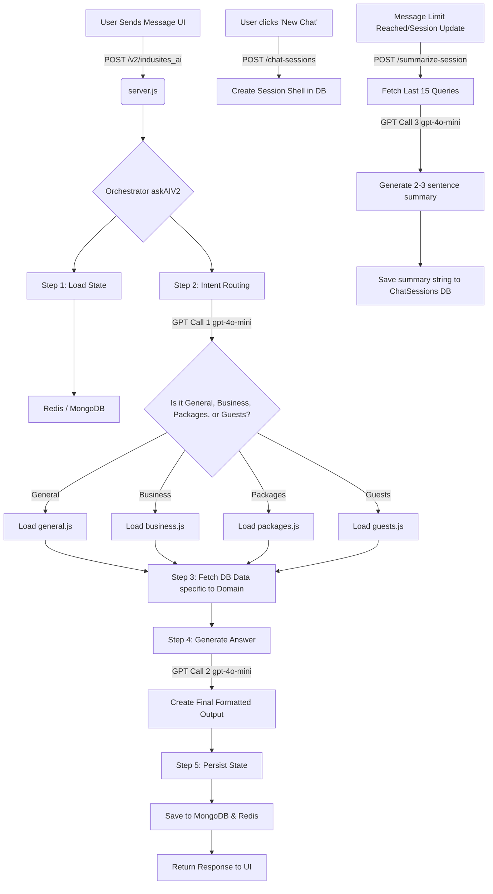

# Indusites AI — Backend

Express server that exposes REST APIs and runs the **AskAI** pipeline for chat, guests, members, and voice transcription.

## Entry point

- **`server.js`** — HTTP server on port `5002` (or `PORT` from `.env`)
- **`AskAI/askAI.js`** — Main AI orchestrator (see [AskAI/README.md](./AskAI/README.md))

## Environment variables

Create a `.env` file in this folder:

| Variable | Required | Description |
|----------|----------|-------------|
| `OPENAI_API_KEY` | Yes | OpenAI API key for router + answers |
| `MONGO_URI` | Yes | MongoDB connection string |
| `PORT` | No | Default `5002` |
| `ASKAI_FLOW_TRACE` | No | `1` = detailed pipeline logs (default), `0` = off |
| `USE_OLLAMA` | No | `1` to send some calls to local Ollama |
| `OLLAMA_BASE_URL` | No | e.g. `http://127.0.0.1:11434` |
| `OLLAMA_MODEL` | No | e.g. `llama3.2` |
| `OLLAMA_FOR` | No | Comma-separated `gptCall` labels to route to Ollama |

## MongoDB

Database name: **`IndusitesMarketingAI`** (see `db.js`).

| Collection | Used for |
|------------|----------|
| `UserQueriesAnswer` | Chat history per member; `followupdetails` powers follow-up routing |
| `IndusitesGuests` | Saved prospects (profile + `ai.intent`) |
| `IndusitesMembers` | Member profile, onboarding intent |
| `compensation_levels` | MLM level criteria (business branch) |
| `IndusitesPackages` | Health packages (age/catalog/guest pitch) |

## API routes

### Chat (core)

| Method | Path | Body / params | Description |
|--------|------|---------------|-------------|
| `POST` | `/indusites_ai` | `memberID`, `question`, optional `image` (multipart) | Main chat — calls `askAI()` |
| `POST` | `/get-user-queries` | `{ memberId }` | Load chat history for UI |
| `POST` | `/transcribe` | `audio` file | Deepgram → `{ transcript }` |

**`/indusites_ai` response shape:**

```json
{
  "answer": "<p>HTML answer...</p>",
  "guideQuestions": ["Want step-by-step team building tips?"],
  "randomThreeQuestions": ["Show my guests", "..."],
  "lang": "mr"
}
```

Optional: `fillInput` when image OCR detected a question to paste into the input box.

### Members

| Method | Path | Description |
|--------|------|-------------|
| `POST` | `/insert-member-info` | Upsert member document |
| `GET` | `/get_member_info` | `?memberId=` |
| `POST` | `/api/member-onboarding` | `{ memberId }` → `{ showPopup: bool }` |
| `POST` | `/api/save-member-intent` | Save intent + interests after popup |

### Guests

| Method | Path | Description |
|--------|------|-------------|
| `POST` | `/add_guest` | `{ memberId, Guest: [...] }` |
| `POST` | `/get_guests` | List active guests for member |

### Other

| Method | Path | Description |
|--------|------|-------------|
| `GET` | `/ping` | Health check |
| `GET` | `/get-compensation-levels` | All compensation level docs |
| static | `/uploads/*` | Uploaded images/audio |

## Folder structure & What Each File Does

```text
Backend/
├── server.js              # Main Express application, sets up HTTP endpoints (/v2/indusites_ai, etc.)
├── db.js                  # Handles connection to the MongoDB database
├── chatSessions.js        # Core session logic: creating new sessions, fetching queries, and automatically summarizing them
├── redisClient.js         # Optional Redis client for fast memory caching (state)
│
├── AskAIv2/               # The New V2 AI Architecture
│   ├── orchestrator.js    # The absolute core of V2. Controls the router (Call 1), picks the domain, and generates answers (Call 2)
│   ├── bootstrap.js       # Database initialization scripts for V2 collections
│   ├── redisClient.js     # Fallback wrapper for Redis session caching
│   │
│   └── domain/            # Domain-specific logic files
│       ├── business.js    # Fetches user level/comp rules; prompts AI to act as a Business Coach
│       ├── general.js     # Fetches basic info; handles greetings, small talk, and out-of-scope steering
│       ├── guests.js      # Fetches user's guest list; prompts AI to act as a Sales Closer for prospects
│       └── packages.js    # Fetches health package info; prompts AI to explain tests and benefits clearly
│
├── AskAI/                 # (Legacy) The older V1 7-layer orchestrator
│   └── askAI.js           # Old main entry point
│
├── rules/                 # Utilities and older V1 rule helpers
│   ├── token.js           # Logs GPT tokens used
│   ├── imageProcessor.js  # Runs OCR on uploaded images to detect questions/guests
│   └── flowTrace.js       # Console debugger for tracing the pipeline
│
└── uploads/               # Local folder where Multer temporarily saves images/audio
```

## AskAI pipeline (summary)

Detailed docs: **[AskAI/README.md](./AskAI/README.md)**

```
User message
    → loadContext (DB)
    → applyMultimodal (image OCR)
    → routeMessage (GPT #1)
    → fetchRequiredData (DB)
    → execute: shortcut | greeting | generateAnswer (GPT #2)
    → saveQuery (DB)
    → JSON to client
```

**GPT budget:** Typically **1** call (`routeMessage`) for shortcuts/greetings that skip generation, or **2** calls (`routeMessage` + `generateAnswer`). Suggestion chips may add a third call when not pre-filled.

## Rules modules

### `token.js`

Wraps `openai.chat.completions.create` with:

- Per-turn `resetSession()` / `getSessionStats()`
- Optional Ollama routing for specific labels
- Token logging

### `imageProcessor.js`

When user uploads an image:

1. OCR + vision extraction of guest fields
2. If guests found → formatted answer + early return (may skip router)
3. If only a detected question → pre-fill input (`fillInput`)
4. Else merge `routingHint` into user text and continue pipeline

### `levelwise.js`

Loads the member’s current compensation level document and formats it as `LEVEL_DATA` for business mentoring answers.

### `agewisepackage.js`

Resolves packages for:

- A specific guest (age + interest)
- Health intent (default age band)
- General catalog (`wantsPackageCatalog`)

### `flowTrace.js`

Structured console output for each pipeline step when `ASKAI_FLOW_TRACE` is enabled.

## Running

```bash
npm install
npm start
```

Multilingual regression (if present):

```bash
npm run test:multilingual
```

## Security notes

- Do not commit `.env` or API keys.
- `db.js` should use `MONGO_URI` from env only in production (remove any hardcoded fallback before deploy).
- Rotate any keys that were ever committed to source control.

---

## 🏗️ Deep Dive for Senior Developers (V2 Architecture & Flow)

This section explains the core logic, conditional flows, session management, and exactly where OpenAI (GPT) is called in the new V2 Architecture.

### 1. The V2 Interaction Flow (Mermaid Diagram)



### 2. How Many GPT Calls Are Made?

In a standard message cycle, **2 GPT calls** are made:
1. **The Router Call (Fast & Cheap):** The user's raw message is sent to `gpt-4o-mini` with a system prompt asking it to strictly categorize the intent into one of four buckets: `general`, `business`, `packages`, or `guests`.
2. **The Generation Call (Heavy & Formatted):** Based on the chosen domain, specific MongoDB data is fetched (e.g., compensation levels or guest lists), and injected into a large, highly customized prompt. This is sent to GPT to generate the final Markdown-formatted answer.

**Conditional / Background Calls:**
- **Summarization Call (1 GPT call occasionally):** When `/summarize-session` is hit by the frontend, the system fetches the last 15 messages and asks GPT to summarize the context in 2-3 lines. This runs independently from the main chat flow.

### 3. How Session Storage Works (Simply Explained)

- **Redis (Speed):** The current `state` (active topic, trust level, language) is cached in Redis so that the bot instantly remembers the context of the *current* conversation without heavily querying the database on every keystroke.
- **MongoDB (Permanence):** 
  - **`ChatSessions` collection:** When a user starts a new chat, we insert a document here with a unique `sessionId`. It acts as the "folder" for the conversation.
  - **`UserQueriesAnswer` / `messages` collection:** Every user prompt and AI response is saved here, tagged with the `sessionId` and `memberId`. 
- **How Summaries Get Into Sessions:** To prevent sending 1,000 previous messages to OpenAI (which costs a lot of tokens), the `/summarize-session` endpoint takes the last 10-15 messages, makes a quick GPT call to condense them into a short paragraph, and updates the `summary` field in the `ChatSessions` document. This short summary is then injected into future prompts, allowing the AI to "remember" previous context cheaply!
